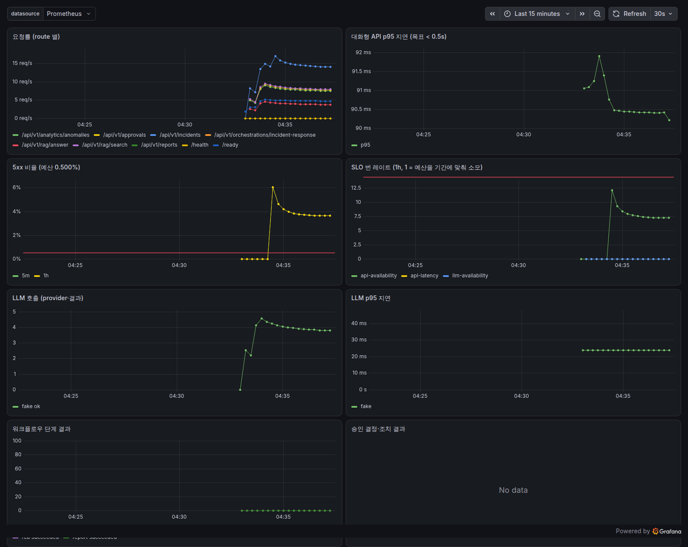

# PLAN-0005: M4 — 예측·보고·운영 안정화

- 범위: 로드맵 3.4 · 2.5 · 4.4 · 4.6 · 1.6
- 진행: 아래 카드 표는 보드에서 자동 생성된다 (전체 보드: [BOARD.md](../BOARD.md))

## 1. 목표

M1~M3 으로 "알람 → 원인 → 승인된 조치 → 복구" 가 돈다. M4 는 이것을 **운영에 내놓을 수 있게** 만든다.

```
            ┌ 예측(3.4): 장애가 나기 전에 — "15분 내 장애 확률", 용량 소진 시점
플랫폼 ─────┼ 보고(2.5): 사람이 매주 받아보는 운영 보고서 (숫자는 코드가, 서술은 LLM 이)
            ├ 보안(4.4): 누가 승인했는가를 '자기 신고'가 아니라 인증으로 + 스키마 마이그레이션
            ├ 관측(4.6): 플랫폼 자신의 SLO(p95 지연·에러율) — /metrics, burn-rate 알람, 대시보드
            └ 기억(1.6): 긴 에이전트 루프에서도 컨텍스트 예산을 넘지 않게 (요약 메모리)
```

## 2. 설계 판단

| 판단 | 이유 |
|---|---|
| **인증은 API Key + 역할(viewer·operator·approver·admin) 먼저, OIDC 는 같은 `Principal` 인터페이스 뒤에 나중에** | Alertmanager·CLI 같은 기계 클라이언트는 API Key 가 자연스럽고 IdP 없이 바로 쓸 수 있다. 키는 **SHA-256 해시만** 설정에 둔다(평문 저장 금지). 승인·해결 등의 `actor` 는 요청 본문이 아니라 **인증 주체**에서 온다. |
| **prod 에서 인증이 꺼져 있으면 기동 거부** | "설정 깜빡함" 이 곧 무인증 승인 API 가 되는 사고를 막는 안전한 기본값 (fail-closed). dev·테스트는 끌 수 있다. |
| **Slack 콜백은 API Key 대신 HMAC 서명 + 승인자 허용 목록** | Slack 은 우리 키를 보낼 수 없다. 서명이 "Slack 에서 왔다" 를, 허용 목록이 "승인해도 되는 사람" 을 보장한다. |
| **Alembic 마이그레이션 + '모델 ↔ 마이그레이션' 드리프트 테스트** | `create_all` 은 컬럼 추가를 반영하지 못한다. 마이그레이션을 빼먹은 모델 변경을 테스트가 잡게 한다 (문서-보드 drift 검사와 같은 발상). |
| **SLO 는 코드 한 곳에 정의하고 Prometheus 규칙·Grafana 대시보드는 생성물** | 문서를 카드에서 생성하듯, 알람 규칙도 SLO 정의에서 생성한다 → 임계치가 두 군데서 어긋나지 않는다. 알람은 Google SRE 의 **멀티 윈도우 burn rate**. |
| **LLM 캐시는 결정적 요청(temperature 0)만** | 같은 입력 → 같은 출력이 기대될 때만 캐시가 의미를 바꾸지 않는다. 키는 메시지·도구·모델·파라미터 전체의 해시. |
| **컨텍스트는 메시지 수가 아니라 토큰 예산으로, 넘치면 오래된 구간을 요약** | 도구 결과 하나가 수천 토큰일 수 있어 "최근 20개" 는 예산을 지키지 못한다. 첫 과제(user) 메시지는 고정 — 잘려 나가면 에이전트가 할 일을 잊는다. 요약 실패 시 잘라내기로 폴백. |
| **장애 예측은 해석 가능한 로지스틱 회귀 + 선형 외삽 기준선과 비교** | M2 의 상황 모델과 같은 이유(계수 = 근거). "N분 전 적중률·리드타임·오경보율" 을 기준선과 나란히 보고한다. 합성 데이터라 **회귀 기준선** 이다. |
| **보고서 숫자는 코드가 집계, LLM 은 fact sheet 로 서술만** | 3.5 원칙. LLM 실패 시에도 숫자 표는 나간다. 주간 보고서 id 는 `weekly-<ISO주>` 로 결정적 → 재시작해도 중복 발송 없음. |

## 3. 카드

<!-- AUTO:CARDS label=plan:0005 -->
| 카드 | 제목 | 상태 | 담당 | 인계 메모 / 막힌 사유 |
|---|---|---|---|---|
| M4-01 | API 인증·인가 (API Key + 역할) — 승인자는 인증 주체로 | ✅ done | claude-code | api/auth.py: Role(viewer/operator/approver/admin), Principal, ApiKeyAuthenticator(SHA-256 해시·compare_digest), build_aut… |
| M4-02 | Alembic 마이그레이션 + 모델↔마이그레이션 드리프트 검사 | ✅ done | claude-code | pyproject 에 alembic 추가. alembic.ini(script_location=src/aiops/db/migrations, URL 은 AIOPS_DATABASE_URL), migrations/env.… |
| M4-03 | /metrics·SLO 정의·burn-rate 알람 규칙·대시보드 생성 | ✅ done | claude-code | observability/metrics.py(전용 REGISTRY, HTTP 요청·지연(라우트 템플릿·class=interactive\|llm), LLM 호출·지연·토큰, 워크플로우 단계, 승인 결정·소요, 조치 … |
| M4-04 | LLM 응답 캐시 + 부하 테스트(p95·에러율 측정) | ✅ done | claude-code | llm/cache.py(ResponseCache: TTL·LRU·deep copy, cache_key=provider+messages+tools+params SHA-256), LLMRouter(cache=, tem… |
| M4-05 | 토큰 예산 컨텍스트 관리 + 요약 메모리 | ✅ done | claude-code | agents/memory/base.py: estimate_tokens(비ASCII 1자=1토큰, ASCII 4자=1토큰, 보수적)·message_tokens·total_tokens, ConversationMemor… |
| M4-06 | 장애 확률 예측 모델 + 용량 예측 + 선제 알람 | ✅ done | claude-code | analytics/prediction.py: PRED_FEATURES 11종(강건 통계, 임계치 정규화) failure_features, predict_failure(FailurePrediction: 확률·eta·… |
| M4-07 | 운영 보고서: 코드 집계 + LLM 서술 + 주간 자동 발송 | ✅ done | claude-code | services/reports.py(collect_facts: 인시던트·이전 기간·MTTR·자동 복구·조치·승인·예측 선행, render_markdown·render_chart_svg·sparkline, unver… |
| M4-08 | 실 환경 부하·관측 검증 (Prometheus·Grafana·배포 서버) | ✅ done | claude-code | 실 검증 완료(outputs 참조): prod 기동 거부/허용, PostgreSQL 마이그레이션·드리프트 0, 실 서버 부하(c20 p95 91ms·c50 p95 182ms, 에러 0), promtool 33규칙,… |

진행: 8/8
<!-- /AUTO -->

## 4. 완료 판정

- 모든 카드 DoD 체크 + `make check` 통과, 측정값은 각 카드 outputs 에 기록.
- 인증을 켠 상태에서 M3 E2E(승인 → 조치 → 복구)가 그대로 동작하고, 승인자가 인증 주체로 기록된다.

## 5. 결과 요약 (2026-10-02)

| 카드 | 결과 | 해석·한계 |
|---|---|---|
| M4-01 인증·인가 | API Key(SHA-256 해시) + 역할 4종, 전역 의존성 1개가 판정(선언 없으면 GET=viewer·그 외=operator). 승인자·행위자 = 인증 주체, `approved_tools` 지정은 approver, Slack 은 서명 + 허용 목록, prod 무인증 기동 거부 | OIDC·키 회전·rate limit 은 다음 과제 (TODO(4.4)) |
| M4-02 마이그레이션 | Alembic 0001·0002, 모델↔마이그레이션 드리프트 테스트, 이력 없는 기존 DB 는 일치할 때만 stamp | **실 PostgreSQL 에서 드리프트 0** (M4-08). 보고서 테이블 추가 때 실제로 이 절차를 사용 |
| M4-03 관측성 | 라우트 템플릿 라벨 메트릭, SLO 3종 → burn-rate 규칙·Grafana 대시보드 **생성**, 생성물 drift 테스트, `/ready` DB 실점검 | 지연 SLO 는 분위수가 아니라 '임계 버킷 이하 비율' — 예산 계산이 가능하도록 |
| M4-04 캐시·부하 | temperature 0 캐시 + single-flight: LLM 호출 99→5회, answer p50 314→21ms (p95 는 미스가 지배) | 프로세스 내 SQLite 기준선 c50 p95 450ms — 병목은 SQLite |
| M4-05 컨텍스트 | 토큰 예산 + 요약 메모리, 과제 메시지 고정(기존 버그), 60 step 루프 예산 초과 0회·요약 9회 | 토큰 추정은 보수적 근사 — 모델별 토크나이저로 교체 여지 |
| M4-06 예측 | 15분 내 장애, 5분 이상 전 적중: 학습 **0.744** / 리드타임 12분 / 오경보 **0.107** vs 선형 외삽 0.667 / 16분 / 0.220. 용량: 피크 기준 소진이 추세 기준보다 2.5배 이름 | 합성 = 회귀 기준선. '오르다 뚝 멈춤'은 과거 값만으론 누수와 구분 불가(대조군 47%) — 맥락 특징 필요 |
| M4-07 보고서 | 숫자는 코드 집계, LLM 서술 속 사실표 밖 수치 경고, SVG 차트, 주간 스케줄(catch-up) — 결정적 id 로 재시작해도 1회 발송 | 다중 인스턴스 스케줄 리스는 TODO(4.5) |
| M4-08 실 환경 | prod 모드 + PostgreSQL + Prometheus + Grafana: c20 p95 **91ms** · c50 p95 182ms(368 RPS 포화), 에러 0. DB 장애 주입 → 6h·1d·3d burn 알람 발화, 1h/5m 은 오류율 3.8% < 7.2% 라 미발화(설계대로) | **실측에서 버그 발견**: DB 장애 시 처리 안 된 예외로 keep-alive 연결이 끊겨 요청 절반이 연결 오류 → 503 핸들러로 수정, 재실험 2500/2500 = 503 |



M4 이후 과제: OIDC·API 이미지 빌드 검증(R-4.4), 실 인시던트 라벨로 예측 재학습(R-3.4), 다중 인스턴스(스케줄·재개 리스, R-4.5).
